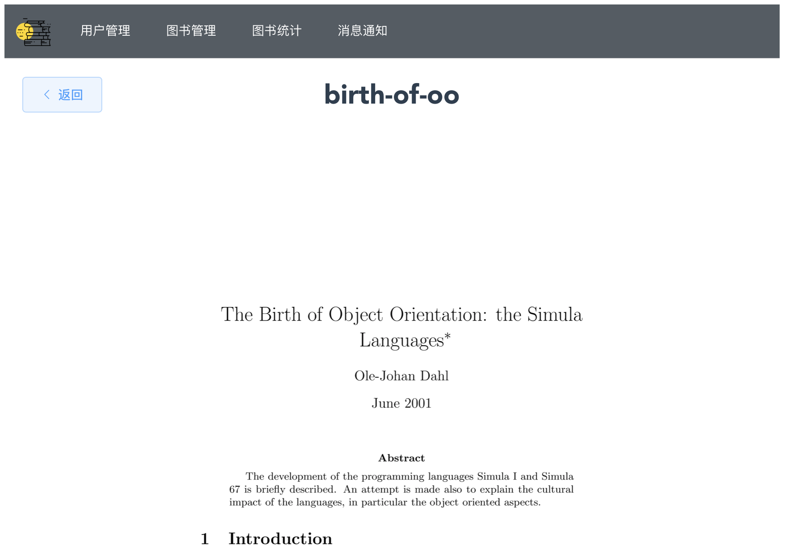

## Software Architecture assignment-3

[TOC]

## 参与者

161250004 曹嘉玮

161250031 顾琦琪

## 项目启动

1. 使用创建library_information数据库，执行``bash.sql``脚本导入数据

   ```shell
   mysql -u root -p
   [输入密码]
   create database library_information;
   use database library_information;
   source [文件路径]
   ```

   

2. 执行``runBackend.sh``脚本或者执行

3. ```shell
   cd library
   mvn spring-boot:run
   ```

3. 执行``runFrontend.sh``脚本或者执行

   ```shell
   cd library-information
   npm install
   npm start
   ```

   

## 项目概况

1. 用户管理

   

2. 图书管理

   

3. 图书统计

   

4. 图书借阅

   

5. 在线阅读

   

6. 修改用户信息

   

7. 用户授权

   

8. 修改图书信息

   

9. 修改后管理员信息提示

   